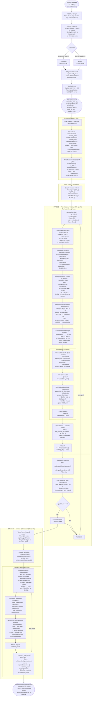

```mermaid
flowchart TD
    A(["`**prepare_data.py**
    --nc pvgis.nc
    --coords panels.csv`"]) --> B

    B["**CSV Loading**
    Read ID, lat, long columns
    Skip malformed rows"] --> C

    C["**NetCDF Loading**
    xr.open_dataset — plain, no kwargs
    Identify time axis vs location axis
    by dimension name"] --> D

    D{"Axis order?"} -->|location=0, time=1| E1["Transpose
    (N,T) → (T,N)"]
    D -->|time=0, location=1| E2["Already
    (T,N) — no-op"]

    E1 --> F
    E2 --> F

    F["**Alignment Check**
    N_csv == N_nc ?
    Cross-check lat/lon vs NetCDF coords"] --> G

    G["**Quality Check**
    Replace NaN / Inf → 0.0
    Report zero fraction
    Exit if 100% zeros"] --> H

    H(["**Saved to disk**
    irradiance_train.npy  shape=(8760, 1149)
    coords.npy            shape=(1149, 2)
    panel_ids.npy         shape=(1149,)"])

    H --> I

    subgraph DATASET ["IrradianceDataset.__init__"]
        I["Load irradiance_train.npy
        Load coords.npy"] --> J

        J["**Coordinate normalisation**
        coords_min = coords.min(axis=0)
        coords_max = coords.max(axis=0)
        coords_norm = (coords − min) / (max − min)
        → pos_tensor shape=(1149, 2) in [0,1]"] --> K

        K["**Irradiance normalisation**
        y_min = irradiance.min()
        y_max = irradiance.max()
        y_norm = (y − min) / (max − min)
        → y_data shape=(8760, 1149) in [0,1]"]
    end

    K --> L

    subgraph LOADER ["DataLoader  —  each batch"]
        L["Sample timestep index t
        Return pos=(1149,2)  y=(1149,1)
        Stack into batch:
        pos=(B,1149,2)  y=(B,1149,1)"]
    end

    L --> M

    subgraph STAGE1 ["STAGE 1  —  Flow-Matching Training  (300 epochs)"]

        subgraph FLOW ["Per-batch forward pass"]
            M["**Sample flow time t**
            u ~ N(0,1)
            t = sigmoid(u)        shape=(B,)
            t_bc = t.view(B,1,1)  shape=(B,1,1)"] --> N

            N["**Interpolate noisy field**
            noise ~ N(0,1)        shape=(B,1149,1)
            y_t = t_bc·y + (1−t_bc)·noise
            target = y − noise  ← velocity to predict"] --> O

            O["**Build field tokens**
            ref_dists = distance to 4×4 reference grid  (B,1149,16)
            x = cat(pos, y_t, ref_dists)                (B,1149,19)
            fx = preprocess(x) + placeholder            (B,1149,374)"] --> P

            P["**Random sensor subset**
            n_sensors ~ Uniform(10, 200)
            idx = randperm(1149)[:n_sensors]
            s_pos = pos[:,idx,:]    (B,S,2)
            s_y   = y[:,idx,:]     (B,S,1)  ← ground truth at sensors"] --> Q

            Q["**Encode sensor context**
            sensor_feat = cat(s_pos, s_y)   (B,S,3)
            s  = sensor_encoder(feat)        (B,S,374)   → cross-attn K,V
            s2 = sensor_encoder_2(feat)      (B,S,93)    → conditioning"] --> R

            R["**Timestep conditioning**
            t_emb = t_embedder(t)            (B,93)
            t_emb = t_emb + s2.mean(dim=1)  (B,93)
            fuses flow time with sensor context"] --> S

            subgraph TRANSFORMER ["Transformer  ×12 layers"]
                S["**Cross-Attention**  (field ← sensors)
                Q from field tokens (adaLN modulated)
                K,V from sensor encodings s
                Field tokens absorb sensor information"] --> T

                T["**FeedForward**
                (adaLN modulated by t_emb)"] --> U

                U["**Physics Slice Attention**
                Cluster 1149 panels into 32 slice tokens
                Self-attention among slice tokens
                Deslice back to 1149 panels
                Handles irregular spatial distribution"] --> V

                V["**FeedForward**
                (adaLN modulated by t_emb)"]
            end

            V --> W["**FinalLayer  →  velocity pred**
            pred = mlp_head(x_out, t_emb)   (B,1149,1)
            predicts the velocity field v_θ"] --> X

            X["**Loss**
            L = MSE(pred, target)
            = MSE(v_θ, y − noise)"]
        end

        X --> Y["**Backward + optimiser step**
        scaler.scale(loss).backward()
        clip_grad_norm(max=1.0)
        Adam step"] --> Z

        Z["**LR Scheduler step**
        Epochs 1–10   : Linear warmup  1e-6 → 1e-4
        Epochs 11–300 : Cosine decay   1e-4 → 1e-6"] --> Z2

        Z2{"epoch % 50 == 0?"} -->|Yes| Z3["Save checkpoint
        Upload to W&B"]
        Z2 -->|No| Z4["Next batch"]
        Z3 --> Z4
        Z4 -->|next epoch| M
    end

    Z3 --> AA

    subgraph STAGE2 ["STAGE 2  —  Sentinel Optimisation  (50 epochs)"]
        AA["**Load frozen Stage 1 model**
        All weights frozen — requires_grad=False
        Only sentinel_pos is trainable  (15,2)"] --> AB

        AB["**Initialise sentinels**
        Pick 15 random panels from coords grid
        sentinel_pos = nn.Parameter(those coords)"] --> AC

        subgraph OPTLOOP ["Per-batch optimisation loop"]
            AC["**IDW sampling**  (differentiable)
            For each sentinel's floating coordinate,
            estimate irradiance as weighted average
            of nearby real panel values
            weights = 1 / dist²
            s_y = Σ(weights · y)              (B,15,1)"] --> AD

            AD["**Flow loss at sentinel positions**
            Same forward pass as Stage 1
            but sensor context comes from
            the 15 sentinel positions only"] --> AE

            AE["**Backward through frozen model**
            Gradients flow:
            loss → mlp_head → transformer
            → sensor_encoder → IDW → sentinel_pos
            Only sentinel_pos accumulates grad"] --> AF

            AF["**Adam step on sentinel_pos**"] --> AG

            AG["**Project → snap to real panel grid**
            dists = cdist(sentinel_pos, all_pos)
            nearest = argmin(dists, dim=-1)
            sentinel_pos = all_pos[nearest]
            Enforces sentinels must be real panels"]
        end

        AG -->|next epoch| AC
    end

    AG --> AH(["**results/sentinel_panels.npy**
    shape=(15, 2)  lat/lon
    The 15 most informative panels
    for reconstructing the full network"])
```